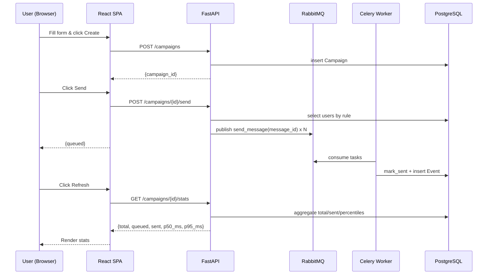

## Massaging Queue Demo 學習指南（新手友善）

本指南帶你用 0→1 學會這個專案的核心系統設計與前後端關鍵知識點，並給出動手練習。

---

### 1) 你將學到什麼
- **前端**：React 18（函式型元件、狀態管理）、Vite、Tailwind 基本用法。
- **後端**：FastAPI（路由/模型/中介層 CORS）、Pydantic（資料驗證）。
- **資料庫**：SQLAlchemy（ORM 模型、Session）、PostgreSQL（唯一鍵、聚合查詢）。
- **非同步**：RabbitMQ（佇列語義）、Celery（工作者、重試、預取、acks late）。
- **系統設計**：同步/非同步拆分、冪等、限流、重試退避、可觀測性、水平擴展。

---

### 2) 一鍵啟動（本地）
1. 先安裝 Docker Desktop。
2. 在專案根目錄執行：
   ```bash
   docker compose up -d --build
   ```
3. 服務入口：
   - API Docs: http://localhost:8000/docs
   - Web UI: http://localhost:5173
   - RabbitMQ 管理介面: http://localhost:15672 （帳密 guest / guest）
   - Postgres: localhost:5432（postgres/postgres）

排錯：若 web 或 api 無法連線，等 RabbitMQ/DB 健康檢查完成或重跑 compose。

---

### 3) 架構速覽
```
[React + Tailwind SPA]
        |
   (REST/JSON)
        v
 [FastAPI API] --(publish job)--> [RabbitMQ] --> [Celery Worker] --(mock provider)--> [Event table]
        |                                                                            
     (PostgreSQL) <------------------------------(mark SENT)---------------------------
```

核心流程：
1. 使用者在前端建立 Campaign。
2. 點擊 Send → API 產生 messages 並丟進 RabbitMQ。
3. Celery Worker 消費任務、模擬外部發送、寫回 `SENT` 與事件。
4. 前端查 `stats` 顯示進度。


#### 3.1 Mermaid 時序圖（Create → Send → Refresh）


---

### 4) 後端關鍵檔案
- `backend/app.py`：FastAPI 初始化、CORS、啟動時建表與種子資料、掛載 `campaigns` 路由。
- `backend/env.py`：環境設定（`DATABASE_URL`、`RABBITMQ_URL`、CORS、SEED_ON_START）。
- `backend/db.py`：SQLAlchemy ORM 模型與 `seed_if_needed()`。
  - `Message`/`Event` 搭配唯一鍵：
    - `uq_campaign_user`：避免同一 user 重複入列。
    - `uq_idempotency`：冪等防重複處理。
- `backend/repo.py`：資料庫存取邏輯（用戶分群、建立 message、標記 sent、統計）。
- `backend/celery_app.py`：Celery 設定（`task_acks_late=True`、`worker_prefetch_multiplier=10`）。
- `backend/routes/campaigns.py`：
  - `POST /campaigns` 建立 Campaign。
  - `POST /campaigns/{cid}/send` 依規則建立 `Message` 並 `send_message.delay(...)` 投遞到 MQ。
  - `GET /campaigns/{cid}/stats` 回傳 `total/queued/sent` 與延遲分位數（p50/p95）。
- `backend/workers/sender.py`：Celery 任務，含退避重試與簡易限流。

重點設計：
- **冪等**：唯一鍵 + 可重入 `create_message()` → 重試安全。
- **重試**：`autoretry_for` + `retry_backoff`。
- **acks late**：Worker 成功處理後再 ack，降低丟單風險。
- **預取**：`worker_prefetch_multiplier` 控制併發與回壓。

---

### 5) 前端關鍵檔案
- `frontend/index.html`：`<div id="root"/>` 掛載點，載入 `src/main.tsx`。
- `frontend/src/main.tsx`：建立 React root、掛載 `App`。
- `frontend/src/pages/App.tsx`：
  - 表單輸入 `name/template/segment_rule`。
  - `Create` → 呼叫 `createCampaign()`。
  - `Send` → 呼叫 `sendCampaign()`。
  - `Refresh` → 呼叫 `getStats()` 顯示 `total/queued/sent`。
- `frontend/src/api.ts`：包裝 API 呼叫，從 `VITE_API_BASE` 讀取 API 位址。

UI 觀念：
- 單向資料流（state → UI）。
- 非同步請求的 loading/錯誤狀態處理（此專案以簡化方式處理）。

---

### 6) API 速查
- `POST /campaigns` Body: `{ name, template, segment_rule }` → 回 `{ campaign_id }`
- `POST /campaigns/{id}/send` → 回 `{ queued }`
- `GET /campaigns/{id}/stats` → 回 `{ total, queued, sent, p50_ms, p95_ms }`

啟動後也可用 Swagger（`/docs`）試打。

---

### 7) Docker Compose 角色
- `db`：Postgres + 健康檢查 + volume。
- `mq`：RabbitMQ 管理介面（15672）與 AMQP（5672）。
- `api`：FastAPI。依賴 db/mq 健康後啟動。
- `worker`：Celery Worker。依賴 api 啟動，從 mq 消費任務。
- `web`：Vite 開發伺服器。

---

### 8) 系統設計精華
- **同步/非同步拆分**：API 快速回應；重活交由 Worker。
- **可靠性**：重試 + 冪等 + acks-late，避免重送重複與丟單。
- **回壓/流量控制**：預取與簡易限流避免打爆下游。
- **可觀測性**：`/stats` 即時回報進度，可延伸接 APM/Otel。
- **水平擴展**：多開 Worker 即可提升吞吐；按租戶分片可進一步隔離噪音。

#### 8.1 容量估算與擴展路線（粗估法）
- 單 Worker 速率（本專案）：`sleep(0.05)` → 約 20 msg/s。若 10% 重試，實際成功速率約 `20 * 0.9 ≈ 18 msg/s`。
- 需要時間（秒）≈ `要發訊息數 ÷ (Worker 數 × 每 Worker 每秒成功處理數)`。
  - 例：要在 10 分鐘（600 秒）內發 100,000 則，單 Worker 18 msg/s：
    - 需要 Worker 數 ≈ `100000 ÷ (18 × 600) ≈ 9.26` → 至少 10 個 Worker。

擴展拉桿：
- 水平擴：增加 Worker 副本數（最穩定）。
- 預取/併發：調整 `worker_prefetch_multiplier`、Celery 併發參數（需觀察延遲與記憶體）。
- 限流/速率：微調 `sleep` 或改為 Token Bucket（避免打爆外部供應商）。
- 佇列分片：依租戶或優先級分流（多 queue + routing key），降低噪音互相影響。
- 批次/合併：若場景允許，批次取用/批次送出可提高效能。

觀測指標：
- 佇列深度、發佈速率、消費速率（應長期趨同）。
- 處理延遲 p50/p95、錯誤率、重試次數。
- DLQ 深度（若導入）、Worker CPU/記憶體、資料庫連線/查詢延遲。

實務建議：先定 SLO（如「10 分鐘內送完 10 萬」），用上式估 Worker 數，逐步擴容並以指標驗證。

---

### 9) 常見問題與排錯
- RabbitMQ 登入：`guest/guest`。若登不進去，重啟 compose，確認未覆寫環境變數。
- API 無法連線：等 db/mq health 好；或檢查 `CORS_ORIGINS`、`VITE_API_BASE`。
- 任務不消費：確認 worker 有啟動、`celery_app.py` 有 autodiscover `workers`。
- 統計為 0：可能任務尚未送達或事件未寫入，稍候再查。

---

### 10) 動手練習（由淺入深）
1. 初階
   - 修改前端文案/樣式，新增一個輸入框（例如自訂發送速率）。
   - 在 `routes/campaigns.py` 讓 `/send` 真的讀 `Campaign.segment_rule`，支援多標籤（`vip,tw`）。
2. 中階
   - 在 `sender.py` 加入「最大重試次數達到後寫入一個 `FAILED` 事件」。
   - 在 `repo.py` 的 `campaign_stats()` 增加 `failed` 計數並呈現於前端。
3. 進階
   - 導入 DLQ（死信佇列）策略與監控儀表板。
   - 加入 Outbox Pattern 或事件儲存以保證跨邊界一致性。
   - 依租戶分片 queue（不同租戶走不同 routing key）。

建議做法：每改一處，寫下你要測的「假設」與「驗證方式」。

---

### 11) 讀碼地圖（快速定位）
- 接入點
  - 前端：`frontend/src/pages/App.tsx`、`frontend/src/api.ts`
  - 後端：`backend/app.py`、`backend/routes/campaigns.py`
- 物流中心
  - 佇列與工作者：`backend/celery_app.py`、`backend/workers/sender.py`
- 資料與一致性
  - ORM 與去重：`backend/db.py`、`backend/repo.py`
- 編排與設定
  - `docker-compose.yml`、`backend/env.py`

---

### 12) 前後端關鍵知識點檢核表
- 前端（已涵蓋章節：5, 6, 8, 11）
  - React 函式型元件與狀態：`App.tsx` 操作流程（5）。
  - API 呼叫與環境變數：`api.ts` 使用 `VITE_API_BASE`（5, 6）。
  - Vite 啟動與掛載點：`index.html`、`main.tsx`（5）。
  - Tailwind 樣式與 UI 結構：表單/按鈕/預覽區塊（5）。
  - 非同步請求的 loading/錯誤處理（5）。

- 後端（已涵蓋章節：4, 6, 7, 8, 11）
  - FastAPI 應用初始化、CORS 設定（4）。
  - Pydantic 請求模型與路由（`CreateCampaignReq`、`/campaigns`）(4, 6)。
  - SQLAlchemy 模型、Session 與唯一鍵冪等（`db.py`、`repo.py`）（4, 8）。
  - 統計查詢與分位數（PostgreSQL `percentile_cont`）（4, 6）。
  - Celery 設定（acks-late、預取）、任務重試與限流（`celery_app.py`、`sender.py`）（4, 8）。
  - RabbitMQ 角色與管理介面（7）。
  - 環境設定與 Docker Compose 依賴（`env.py`、`docker-compose.yml`）（7, 11）。

- 端到端（已涵蓋章節：3, 3.1, 3.2, 8）
  - 流程：Create → Send → Refresh。
  - 解耦與回壓、可靠性（重試/冪等/acks-late）、水平擴展（多 Worker）。

若上列任一項你想要更深入，回到對應章節或提出要新增的練習題。

---

#### 12.1 TODO 對應（與學習章節連結）
- 拆同步/非同步與 RabbitMQ 的價值 → 章節 3、3.1、3.2、8。
- 三個可靠性機制（去重、重試、限流）→ 章節 4「重點設計」、8；去重見 `db.py` 唯一鍵與 `repo.py` 冪等、重試與限流見 `sender.py`。
- 容量估算與擴展路線（加 worker、分片 queue、觀測指標）→ 章節 8.1。

---


